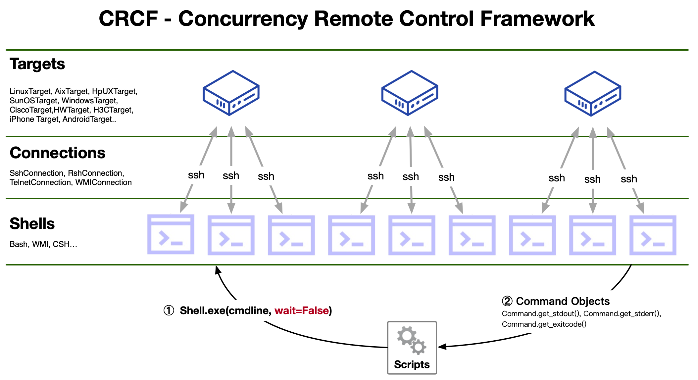

# CRCF - Concurrent Remote Control Framework

提供对多个长时间连接的远程设备的并发控制。
## 架构

架构源自于一个更老的项目“CCTF - CONCURRENT CONTROL TEST FRAMEWORK”。本项目将其进行裁剪，将涉及测试harness的部分取消，保留远程设备并发控制的能力并进行日志优化。

基础架构如下：

### 主要的对象

**Target 对象**
CRCF将每个目标设备或目标设备都抽象为一个“Target”（目标）对象。target对象是一个抽象的概念，一个Target对象在CRCF中代表了一个目标设备。目标设备可能是一台主机，可能是一台交换机、路由设备 ，电源设备，甚至可能是一台手机。target对象的抽象设计非常便于扩展，以支持各种主机和设备。

**Connection 对象**
Connection对象即“连接对象”，代表一个从测试主机到目标设备的连接。所有的网络通信都通过连接对象来传输。连接对象也是一个抽象的概念，所支持的连接类型也可以随意扩展。例如，Linux设备可能是通过SSH连接，一些老的UNIX系统可能通过RLOGIN和TELNET连接，一些IoT设备、网络设备等可能通过TELNET连接。因为不同的设备可能有不同的连接方法，因此将连接方法抽象设计使得用户可以随时针对新设备类型添加新的连接类型。
一个用户脚本可以针对每个“Target对象”创建多个连接，也可以为多个设备创建多个Target对象，以达到同时连接多个设备的目的。连接对象的数量是没有限制的。连接数越多，理论上的并发性越高。

**Shell对象**
Shell对象给用户提供了一个模拟的操作目标设备的窗口，就正如用户在PC机屏幕前通过ssh命令连接到远程设备然后获取到一个shell提示符一样。用户可以通过shell对象给目标发送命令。每个Shell对象内部都有一个命令队列，同时每个Shell对象还有一个后台线程与之关联，用于从命令队列中读取命令，然后通过Connection对象将命令发送给目标设备（由Target对象代表）。

**Command对象**
CRCF里使用一个“Command”对象封装一条发送到远程设备执行的命令。命令对象被用户脚本提交给“Shell”对象，后者将命令对象压入命令队列，然后在稍后的某个时间，该命令对象会被后台线程取出并发送到目标设备上执行。当命令在目标设备执行完成后，命令对象的内部状态被修改。在稍后的时候，用户代码可以通过命令对象检查命令执行的结果。
由于命令的执行者是“Shell”对象的后台线程，因此命令执行期间并不会阻塞用户代码的主线程。并且，每个“Shell”对象都有自己的Connection对象以及后台线程，因此多个“Shell”对象同时执行命令，可以实现真正的并发。